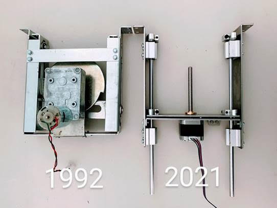
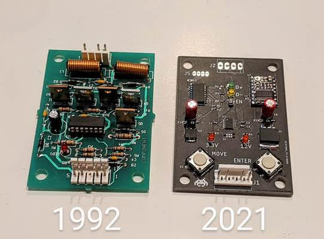
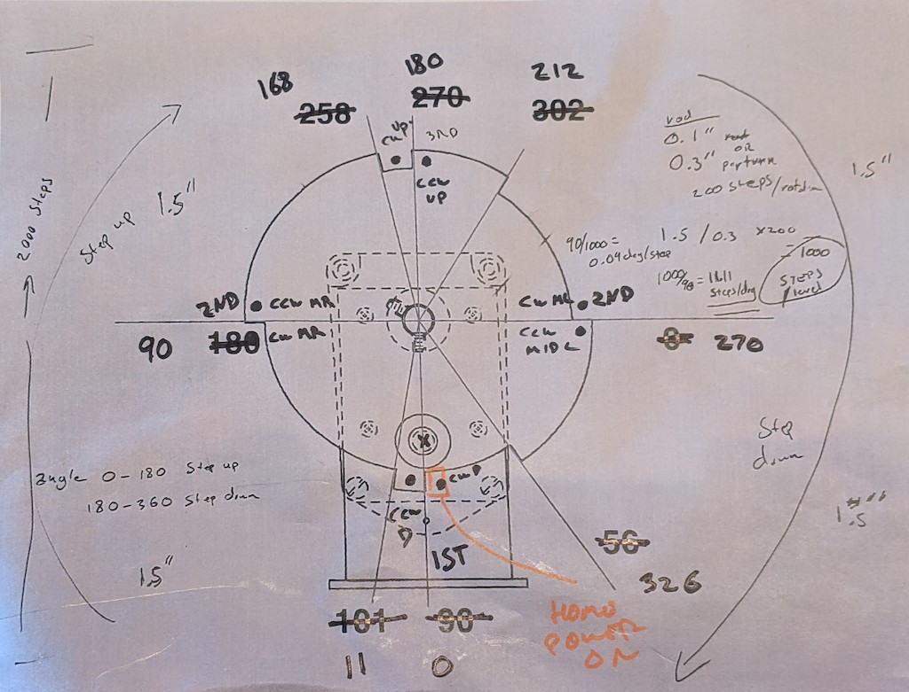

# dr-who

Replacement elevator mechanism for the Dr Who pinball machine. 

https://en.wikipedia.org/wiki/Doctor_Who_(pinball)

https://youtu.be/fHkql48IPpg

https://youtu.be/L-MsUkgBwkI

<table><tr>
<td rowspan="2"></td>
<td rowspan="2"></td>
</tr>
<tr><td></td></tr>
</table>

## Firmware
* Drop in replacement to original system
* Uses simulated cam stimulus into factory system
* Passes factory diagnostics tests 

## Electronics
* Custom electronics
* Drop in replacement for bi-directional motor board A-15782
* Modern current limiting for saftey
* Modern acceleration and deceleration profiles for smooth start and stop

## Mechanical
* Custom brackets - laser cut and bent
* Standard desktop CNC stepper motor, rod, and nut.
* Replaces original parts
  * Cam A-15035
  * Motor 14-7970
  * Bracket A-15037
  * Support Bracket A-15036
  * Roller 02-4764

